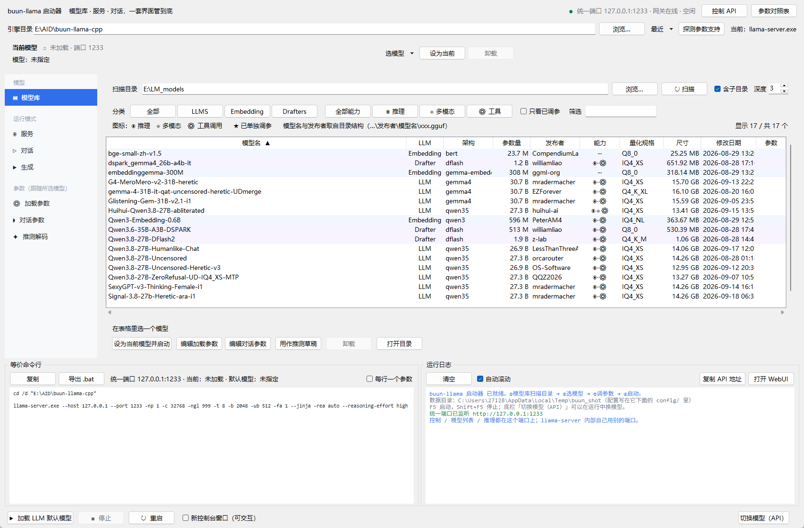

# buun-llama-cpp 控制台

给 [spiritbuun/buun-llama-cpp](https://github.com/spiritbuun/buun-llama-cpp) 用的图形化启动器。
只用 Python 标准库的 tkinter，**不需要 pip 安装任何东西**；也可以打包成单文件 exe 便携运行。



---

## 它是什么

一个「把命令行参数做成界面 + 管住 llama-server 进程」的桌面工具：

- **模型库**：扫描 GGUF、按目录结构认发布者和模型名、读元数据算真实参数量、
  标出能力（多模态 / 工具 / 思考 / 草稿），选中即可加载。
- **服务**：OpenAI 兼容的 HTTP 服务。对外只有**一个端口**，
  控制 API、`/v1/*`、内置 WebUI 全在这里。
  一个 llama-server 进程带多个模型子进程（**多模型路由**），各模型可单独加载 / 卸载、
  互不影响；同时驻留几个、空闲多久自动卸，见「服务」页的**驻留策略**。
- **对话 / 生成**：终端里跑 `llama-cli`（多轮对话）或 `llama-completion`（一次性生成）。
- **参数页**：加载参数、对话参数、推测解码（三者都**跟模型走**）；
  服务页（OpenAI 兼容 HTTP）与对话页（llama-cli 多轮 / llama-completion 一次性）各自一套运行参数。

## 运行

```bat
:: 源码运行（需要带 tkinter 的 Python；本机是 E:\Python\Python311）
start_gui.bat               :: 正常启动
start_gui_debug.bat         :: 带控制台，方便看报错

:: 自检（不开窗口，跑一遍核心逻辑，末行 OK）
E:\Python\Python311\python.exe buun_launcher.pyw --selftest

:: 打包成便携**单文件** exe（产物 dist\buun_llama_gui.exe，约 10.8 MB）
E:\Python\Python311\python.exe build_portable.py

:: 需要带控制台的调试版（排查问题用）时加 --debug，会多出一个 buun_llama_gui_debug.exe
E:\Python\Python311\python.exe build_portable.py --debug
```

> 解释器必须是 `E:\Python\Python311\python.exe`（3.11.8，自带 tkinter 8.6）。
> 托管 Python 3.13 没有 tkinter，跑不了本程序。

配置放在**程序自己所在目录**下的 `config/`——**便携**：不写注册表、不碰 `%APPDATA%`。
打包成 exe 后取的是 **exe 所在目录**（跟从哪个目录启动无关），而且**首次运行就会生成**。
只有该目录真的不可写时才回退到 `%LOCALAPPDATA%\buun_llama_gui`，原因会写进启动日志。

### config 目录长这样

```
config/
  app.json                 软件级设置：引擎路径、模型目录、界面偏好、控制 API、运行参数
  models/
    <模型名A-27B>.json     每个「配过参数的模型」一个文件
    <模型名B-MoE>.json
  cache/
    scan.json              模型库扫描缓存（GGUF 元数据，可随时删掉重建）
  selftest.log             自检输出
```

- **文件名 = 模型库里的显示名**（非法字符替换成 `-`，重名自动加 `-2`）。
  文件内的 `path` 才是权威标识，所以**给模型改名不会丢设置** —— 下次保存时
  文件名会跟着改过去。
- 单个模型的文件通常几 KB，好备份、好分享、好手动改；某个模型调崩了删它那一个就行。
- 老的单文件 `config.json` 会在首次启动时**自动拆分**，原件改名成
  `config.legacy.json` 留退路（内容一字不改，想回滚直接改回 `config.json`）。
  拆分结果会写进启动日志。

---

## buun 这套引擎特有的地方

### KV 缓存档位（buun 的立身之本）

`-ctk` / `-ctv` / `-ct` 的档位比上游多一批：

| 类别 | 档位 | 说明 |
|---|---|---|
| 常规 | `f32` `f16` `bf16` `q8_0` `q5_1` `q5_0` `q4_1` `q4_0` `iq4_nl` | 和上游一样 |
| Turbo | `turbo8` `turbo4` `turbo3` | fork 自带的 TurboQuant KV 编解码 |
| TCQ | `turbo3_tcq` `turbo2_tcq` `turbo1_tcq` | 需要码本文件（见下） |
| 动态 | `vbr` | 按显存压力逐 (层, 侧) 降级，**也是本 build 的默认** |

**三个必须知道的坑：**

1. **默认值就是 `vbr`**，不是 `f16`。界面上「统一 KV 档位」显示 `vbr` 但没勾选时，
   就是引擎的默认行为（隐式 t4 地板）。
2. **turbo / TCQ / VBR 的 KV block 是 128 个值**，要求模型 `n_embd_head_k`
   能被 128 整除，并且必须开 `-fa`。
   - 主流大模型系列（Qwen / Gemma 等）、多数 7B+ 模型 head_dim 是 128 / 256 → 没问题；
   - 部分小模型（如某些嵌入模型，head_dim=64）→ 会直接报
     `K cache type turbo4 with block size 128 does not divide n_embd_head_k=64`；
   - **而且因为默认就是 vbr，什么都不设也会踩到。** 启动器会读 GGUF 里的
     head_dim 提前拦住，并告诉你把 K/V 两侧显式设成 `q8_0` 之类。
3. **TCQ 档位需要码本**：`codebooks/3bit/cb_50iter_finetuned.bin` 与
   `codebooks/2bit/tcq_2bit_100iter_s99.bin`，通过环境变量传给子进程：

   ```
   TURBO_TCQ_CB  = <引擎目录>\codebooks\3bit\cb_50iter_finetuned.bin
   TURBO_TCQ_CB2 = <引擎目录>\codebooks\2bit\tcq_2bit_100iter_s99.bin
   ```

   启动器会自动推导引擎目录、找到码本并注入（你自己设过同名变量则不覆盖）。
   仓库里缺文件时会写警告，此时 `turbo*_tcq` 档位不可用。

### VBR 动态量化（加载参数页 → VBR 动态量化）

只有把 KV 档位选成 `vbr` 时这一节才真正起作用。降级阶梯：

```
f16 → turbo8 → turbo4 → turbo3_tcq → turbo2_tcq → turbo1_tcq
```

**「最低档位下限」（`--vbr-floor`）做成了挡位按钮**：
`跟随引擎 / turbo8 / turbo4（默认）/ turbo3_tcq / turbo2_tcq / turbo1_tcq`。
默认 `turbo4` —— 比引擎在「显式 `-ct vbr`」时的隐式下限（`turbo1_tcq` = 1.25 bpv）
保守得多。

各档的**真实比特单价**（本机逐档实测，从 `/slots` 的 `kv_bpv` 读回来的，
含量化块的 scale 开销，不是整数）：

| 档位 | bpv | | 档位 | bpv |
|---|---|---|---|---|
| f16 / bf16 | 16.0 | | turbo4 | 4.125 |
| q8_0 | 8.5 | | turbo3 | 3.5 |
| turbo8 | 8.125 | | turbo3_tcq | 3.25 |
| q5_1 | 6.0 | | turbo2_tcq | 2.25 |
| q5_0 | 5.5 | | **turbo1_tcq** | **1.25** |
| q4_1 | 5.0 | | q4_0 / iq4_nl | 4.5 |

其他可调项：`--vbr-codec`（auto/turbo/classic）、`--vbr-entry`（起始档）、
`--vbr-vram`（显存预算）、以及 server 专属的 `--vbr-prompt-cache` /
`--vbr-anchor-cache-mib` / `--vbr-reclaim-floor` / `--vbr-reset-keep-frac`。

**三条会挡住启动的约束**（启动器都会提前校验并说明）：

1. 下限**不能高于**起始档位 —— 引擎直接报错
   `--vbr-floor (4.125 bits/value) cannot exceed --vbr-entry t2 (2.25 bits/value)`。
2. `--vbr-codec classic` 时 turbo 档位非法（classic 阶梯只认 `q8_0` / `q4_0`）。
3. 下限低于阶梯最低点时引擎**只警告并抬到最低点**，不报错。

> ⚠️ **KV 档位不是 `vbr` 时，这一整组参数会被自动丢弃。**
> 引擎对「非 vbr 的 KV + `--vbr-*`」是硬报错
> （`--vbr-* flags need a VBR cache side`），而这组参数默认就带着
> `--vbr-floor turbo4`，所以启动器加了一道闸：只有 KV 确实是 vbr 才输出它们，
> 被忽略时会在日志里说明原因。

### 上下文长度：留空 = 引擎自动算

「上下文长度」（`-c`）**默认留空**，意思是交给引擎自己算：

1. 起点是**模型的训练上下文**（本机多数模型是 262144）；
2. 按**可用显存**（扣掉模型与显存余量）往下缩；
3. KV 成本按 **「最低档位下限」那一档的单价**计价；
4. 缩到刚好装下为止，下限是「自动时的下限」（`--fit-ctx`，默认 4096）。

**实测（以某 27B 模型为例，可用显存 4875 MiB）** —— 这条链把「下限」和「能开多长」绑在一起：

| `--vbr-floor` | 引擎自动算出的 n_ctx |
|---|---|
| `turbo1_tcq`（1.25 bpv） | **262144**（撞模型上限） |
| `turbo4`（4.125） | **262144**（容量约 31 万，仍撞上限） |
| `turbo8`（8.125） | **156672** |
| `f16`（16） | **80640** |

所以想要长上下文，就把下限压狠一点；想要 KV 精度，就得接受上下文变短。

相关的两个参数：**显存保留余量**（`--fit-target`，默认 1024 MiB，余量越大
留给 KV 的越少 → 自动算出的上下文越短）和**自动时的下限**（`--fit-ctx`）。

> 常见误解：**`--vbr-vram` 不参与上下文长度计算**。实测给它 16 MiB
> （远低于全上下文的成本）时 n_ctx 一点没变，引擎只警告一句
> `the KV budget (16 MiB) is below the full-context cost ...`。
> 它只驱动**运行时降级控制器**。

### 实时运行状态（底部状态条）

启动后会常驻在命令行/日志上方，数据全部来自引擎自己暴露的接口，
**不需要加任何引擎参数**：

| 显示 | 来源 |
|---|---|
| 生成 / 提示处理速度 | 每次转发响应体里的 `timings.predicted_per_second` / `prompt_per_second`（**默认就带**） |
| 当前 KV 档位 | `/slots[].kv_bpv` 与 `/props.vbr` 反查（没降级时按 `--vbr-floor` 单价显示） |
| 上下文长度与已用比例 | `/props.default_generation_settings.n_ctx`、`/slots[].n_prompt_tokens` |
| VBR 状态 | `/props.vbr` → `codec` / `entry_type_k\|v` / `floor_bpv` / `capacity_floor_bpv` / `realized_bpv` / `vram_budget_bytes` |
| 缓存命中 | `timings.cache_n` |

例：`运行状态：生成 365 t/s · 提示 399 t/s · KV vbr·当前 f16 · 未降级（下限 4.12 bpv） · 上下文 60 / 16384 · 空闲`

> 降级发生后 `realized_bpv` 才有值，状态条会改成「已降级」。
> 混合状态（例如 4.25 bpv = t4 布局夹几个单元高一档）显示成 `≈turbo4（4.25 bpv）`。

### 多模态投影：按需进显存

`--mmproj-gpu-swap` 让投影文件**先加载在内存（CPU），只有真的来了带图片的请求
才换进显存**，媒体请求处理完再换回内存 —— 省显存，代价是首次看图多一次搬运。
启动日志会打 `loaded multimodal model on CPU (GPU swap enabled)`。

配套还有两项：**投影 GPU 卸载**（`--no-mmproj-offload` = 投影永不进显存，
每次看图都在 CPU 算）和**投影所在设备**（`-mmdev`，填 `none` 等价于不卸载）。

> 要腾显存时会先把可重载的投机上下文（MTP / 外部 DFlash）换出去，用完恢复。
> 若草稿模型是**不可重载**的类型，这个功能不可用，引擎只会打一行警告并让两者都常驻：
> `mmproj GPU swap is unavailable for this external draft type; keeping both resident`。
> 只有 `llama-server` 有这个参数。

### 推测解码接口

- `--spec-type` 收的是**逗号分隔的类型名列表**，可以同时挂多种。
  认这些名字：`draft-simple` `draft-eagle3` `draft-mtp` `draft-dflash`
  `draft-dspark` `dflash` `ngram-simple` `ngram-map-k` `ngram-map-k4v`
  `ngram-mod` `ngram-cache` `suffix` `copyspec` `recycle`
  （`draft`=`draft-simple`、`mtp`=`draft-mtp` 是等价别名）。
- 所有细项都是**独立 flag**：`--spec-draft-n-max` / `--spec-draft-n-min` /
  `--spec-draft-p-min` / `--spec-draft-p-split` / `--spec-draft-temp`；
  n-gram 参数按算法分别命名（`--spec-ngram-simple-size-n` 等）。
  旧的 `--spec-ngram-size-n` / `-size-m` / `-min-hits` 在本 build 已被上游删除。
- `draft-mtp` **不需要**草稿模型（用主模型自带的 MTP 层，没有就只打一行警告跳过）；
  `draft-simple` / `draft-eagle3` / `draft-dflash` / `draft-dspark` / `dflash`
  需要 `-md`。启动器按这个规则提前校验。
- 推测解码只有 `llama-server` / `llama-cli` 支持，`llama-completion` 一个都不认。

### 推理强度是原生参数

本 build 有 `--reasoning-effort LEVEL`（`minimal`/`low`/`medium`/`high`/`xhigh`/`max`），
请求体里的顶层 `reasoning_effort` 引擎原生支持，网关原样透传。

### 向量模型（embedding）：单块不能超过物理批大小

引擎对 `/v1/embeddings` **不做分块**（`server-task.h` 的 `can_split` 只在
pooling=last 时为真），输入一超过物理批大小就直接失败：

```
input (1008 tokens) is too large to process.
increase the physical batch size (current batch size: 512)
```

RAG 软件（AnythingLLM / Dify / Cherry Studio / LlamaIndex…）默认把文档切成
~1000 token 一块，所以默认的 `-ub 512` 会「短文本调得通、一喂文档就崩」。
`builder.emb_guard()` 因此给 embedding 类模型自动把 `batch-size` / `ubatch-size`
抬到 `min(4096, 模型训练长度)`（`EMB_MIN_UBATCH`）。三个附带事实：

- **`-ub` 会被引擎压到 `-b`**（实测 `-b 2048 -ub 4096` → 实际 2048），所以抬
  ub 必须连 b 一起抬。
- 模型的**训练长度是硬顶**：引擎会把 slot 的 n_ctx 压到它（`the slot context
  (4096) exceeds the training context of the model (512) - capping`）。
  训练长度 512 的 bge-small 无论怎么调都吃不下 1000 token 的块 —— 只能让客户端
  把 chunk size 调小或换模型。启动时 `audit_preset_models()` 会为这类模型写警告。
- 界面上把「物理批处理大小」**取消勾选**（不传 `-ub`）就完全不自动干预。

---

## 代码结构

```
buun_launcher.pyw          入口（双击 / --selftest）
buunllama_gui/
  schema.py                参数单一事实来源：114 个参数项、8 个页面（服务只有「多模型路由」一种跑法）
  engine.py                引擎层：TCQ 码本推导与环境注入、CUDA 运行时依赖体检
  builder.py               参数 → 命令行 / 预置 INI、校验（VBR/turbo/推测解码约束）、.bat
  probe.py                 跑 --help 解析当前 build 认哪些 flag
  gguf.py                  GGUF 只读解析（含 head_dim，用于 turbo 档位前置校验）
  runtime.py               运行时状态：轮询 /props + /slots，反查 KV 档位与已用比例
  scan.py                  模型库扫描与分类
  manager.py / process.py  进程生死 + 命令总线（不跨线程碰 tkinter）
  router.py                多模型路由后端：模型清单轮询 / 装卸载 / 按类限流 + 空闲卸载
  unified.py               路由进程的状态载体（端口 / 是否在跑 / 当前目标模型）
  control_api.py           控制 API + /v1 网关（转发时顺手抓 timings 喂给运行时状态）
  ui.py / widgets.py       界面（含底部运行状态条）
  store.py / theme.py      配置持久化（app.json + 每模型一份）/ 配色
```
